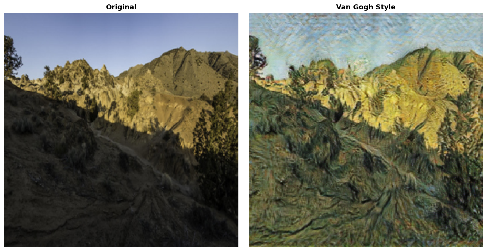
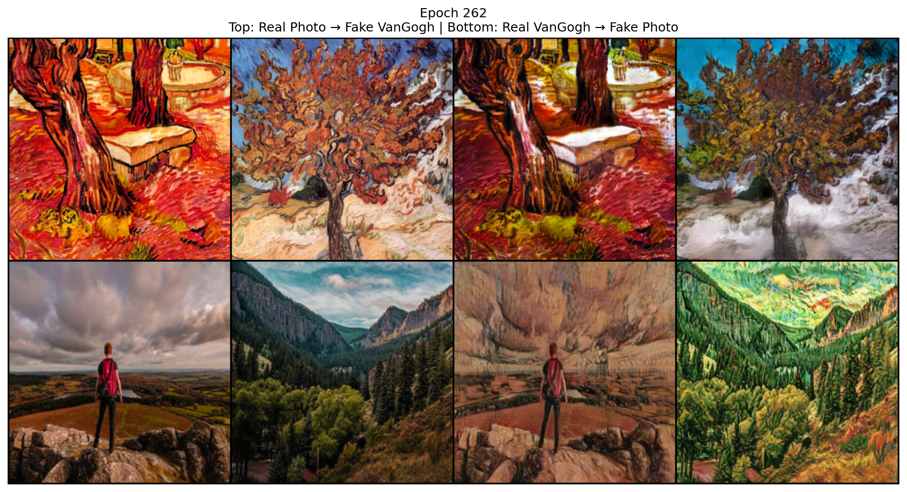
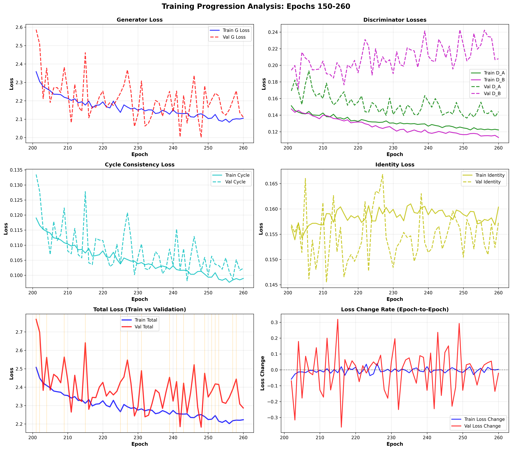

# CycleGAN: Photo ↔ Van Gogh Style Transfer

A PyTorch implementation of **CycleGAN** for unpaired image-to-image translation, specifically trained to transform photographs into Van Gogh painting style and vice versa.

---

## Overview

This project implements **CycleGAN (Cycle-Consistent Generative Adversarial Networks)** for artistic style transfer between two unpaired image domains: real-world photographs and Van Gogh paintings. The model learns **bidirectional mappings** without requiring paired training examples.

---

## Architecture

### Generators (G_AB and G_BA)
- ResNet-based architecture with 9 residual blocks  
- Input/Output: 256×256 RGB images  
- Downsampling: 2 convolutional layers (stride 2)  
- Upsampling: 2 transposed convolutional layers  
- Normalization: Instance Normalization  
- Activation: ReLU (hidden layers), Tanh (output layer)  

### Discriminators (D_A and D_B)
- PatchGAN architecture (70×70 patches)  
- 4 convolutional layers with stride 2  
- Normalization: Instance Normalization  
- Activation: LeakyReLU (0.2)  
- Output: 16×16 feature map  

---

## Loss Functions

Three complementary loss functions are used:

1. **Adversarial Loss (GAN Loss):** MSE loss encouraging generated images to be indistinguishable from real images  
2. **Cycle Consistency Loss:** L1 loss ensuring \(F(G(x)) \approx x\) (forward-backward consistency)  
3. **Identity Loss:** L1 loss preserving color composition when input is already in the target domain  

**Total loss:**
\[
L_{\text{total}} = L_{\text{GAN}} + \lambda_{\text{cycle}} \cdot L_{\text{cycle}} + \lambda_{\text{identity}} \cdot L_{\text{identity}}
\]  

Where \(\lambda_{\text{cycle}} = 15.0\) and \(\lambda_{\text{identity}} = 0.1\).

---

## Training Configuration

### Hyperparameters
- Epochs: 300 (early stopping enabled)  
- Batch size: 2  
- Learning rate: 0.0002 (Adam optimizer, Beta1=0.5, Beta2=0.999)  
- Learning rate decay: Linear after epoch 150  
- Image size: 256×256  

### Data Augmentation
- Random resize (1.12×), crop to 256×256  
- Random horizontal flip (p=0.5)  
- Color jitter (brightness, contrast, saturation, hue)  

Validation: Only resize + normalization  

### Training Features
- **Replay Buffer:** Stores 50 previously generated images  
- **Early Stopping:** Patience of 20 epochs  
- **Overfitting Detection:** Threshold: 0.15  
- **Checkpoint System:** Resume from latest checkpoint automatically  
- **Sample Generation:** Periodic during training  

---

## Project Structure

```

CycleGAN/
├── models/
│   └── networks.py         # Generator & Discriminator architectures
├── utils/
│   ├── dataset.py          # Unpaired dataset loader
│   └── helpers.py          # ReplayBuffer, LambdaLR, etc.
├── data/
│   └── vangogh2photo/
│       ├── trainA/         # Van Gogh paintings
│       ├── trainB/         # Real photos
│       ├── val/testA/      # Validation Van Gogh
│       └── val/testB/      # Validation photos
├── checkpoints/            # Saved model weights
├── samples/                # Generated training samples
├── logs/                   # Loss history & training logs
├── results/                # Generated outputs
├── train.py                # Main training script
├── test.py                 # Inference script
└── analyze_training_progression.py  # Visualization & analysis

````

---

## Installation

**Requirements**
```bash
torch>=1.9.0
torchvision>=0.10.0
numpy>=1.19.0
matplotlib>=3.3.0
Pillow>=8.0.0
tqdm>=4.62.0
````

Install via pip:

```bash
pip install torch torchvision numpy matplotlib Pillow tqdm
```

---

## Usage

### Training

```bash
python train.py
```

* Resumes automatically from the latest checkpoint
* Periodically validates model
* Generates sample images
* Saves best models based on validation loss

### Inference

Single image:

```bash
python test.py --mode single \
               --model checkpoints/G_AB_best.pth \
               --input test_images/photo.jpg \
               --output results/result.png
```

Entire directory:

```bash
python test.py --mode directory \
               --model checkpoints/G_AB_best.pth \
               --input test_images/ \
               --output results/
```

Both directions:

```bash
python test.py --mode both \
               --model checkpoints/G_AB_best.pth \
               --model_ba checkpoints/G_BA_best.pth \
               --input test_images/photo.jpg \
               --output results/both_directions.png
```

### Training Analysis

```bash
python analyze_training_progression.py
```

* Generates loss curves and overfitting reports

---

## Training Results (Epochs 150–260)

### Training Metrics

| Metric          | Start | End   | Δ       | Mean  | Std Dev |
| --------------- | ----- | ----- | ------- | ----- | ------- |
| Generator Loss  | 2.358 | 2.105 | -10.72% | 2.163 | 0.055   |
| Discriminator A | 0.151 | 0.122 | -19.24% | 0.132 | 0.007   |
| Discriminator B | 0.147 | 0.113 | -23.24% | 0.126 | 0.009   |
| Cycle Loss      | 0.119 | 0.099 | -16.87% | 0.105 | 0.005   |
| Identity Loss   | 0.156 | 0.160 | +2.50%  | 0.158 | 0.001   |
| Total Loss      | 2.507 | 2.223 | -11.34% | 2.292 | 0.063   |

### Validation Metrics

| Metric          | Start | End   | Δ       | Mean  | Std Dev |
| --------------- | ----- | ----- | ------- | ----- | ------- |
| Generator Loss  | 2.587 | 2.111 | -18.39% | 2.209 | 0.109   |
| Discriminator A | 0.169 | 0.144 | -14.80% | 0.153 | 0.012   |
| Discriminator B | 0.194 | 0.208 | +7.12%  | 0.209 | 0.016   |
| Cycle Loss      | 0.133 | 0.102 | -23.35% | 0.108 | 0.007   |
| Identity Loss   | 0.157 | 0.157 | +0.34%  | 0.155 | 0.005   |
| Total Loss      | 2.768 | 2.287 | -17.39% | 2.390 | 0.111   |

**Overfitting:** 18 warnings (~30% of epochs)

---

## Qualitative Results

**Example: Photo → Van Gogh Style**

  

- Captures Van Gogh’s characteristic brushwork  
- Preserves color composition and semantic content  
- Dynamic textures reminiscent of paintings like *Starry Night*

**Latest Sample: Final Epoch (Epoch 262)**

  

**Training Progression (Epochs 150–260)**

  


## Key Implementation Details

* **Replay Buffer:** 50 images, 50% chance to use old images during discriminator update
* **Learning Rate Scheduling:** Constant for first 150 epochs, then linear decay
* **Validation & Overfitting:** Monitors train-validation loss gap, early stopping
* **Memory Efficiency:** Non-interactive matplotlib backend, explicit figure closure

---

## Technical Considerations

* GPU recommended (CUDA-enabled)
* Min 8GB GPU memory (batch size 2)
* Approx. 20–30 hours for 200 epochs on single GPU
* Minimum 400–500 images per domain

---

## Model Checkpoints

* **Periodic:** Every 5 epochs
* **Best Model:** Validation loss improvement (G_AB_best.pth, G_BA_best.pth)
* **Final Model:** At training completion (G_AB_final.pth, G_BA_final.pth)

Each checkpoint includes generator & discriminator weights, optimizer states, and epoch number.

---

## Monitoring and Logging

* Console output (tqdm)
* Text logs: `logs/training_log_TIMESTAMP.txt`
* Loss history: JSON file `logs/loss_history_TIMESTAMP.json`
* Sample images: `samples/epoch_N.png`

---

## Citation

```bibtex
@inproceedings{zhu2017unpaired,
  title={Unpaired Image-to-Image Translation using Cycle-Consistent Adversarial Networks},
  author={Zhu, Jun-Yan and Park, Taesung and Isola, Phillip and Efros, Alexei A},
  booktitle={IEEE International Conference on Computer Vision (ICCV)},
  year={2017}
}
```

---

## License

For educational and research purposes. Ensure compliance with CycleGAN and dataset licenses.

---

## Future Improvements

* Multi-scale discriminators
* Attention mechanisms
* Progressive training
* Spectral normalization
* FID/IS quantitative evaluation
* Interactive web interface
* Video style transfer

---

## Acknowledgments

* Original CycleGAN paper by Zhu et al.
* Van Gogh paintings dataset
* PyTorch framework
* Open-source utilities and community

---

## Contact

Questions, issues, or contributions: see project repository or contact maintainer.

```
